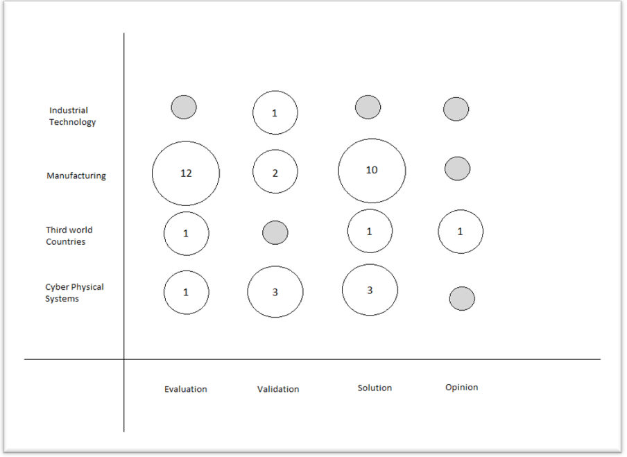

# Research Methods

by Heider Jeffer hjeffer at unibz dot com  
Supervisor Prof. Barbara Russo

Date(s): 2018 January 10th  
Document status: Proposed

# Theme: Third World Developing Countries (Industry 4.0) 

# Possible RQ

- **RQ1:** How is Industry 4.0 changing the manufacturing landscape in
  third world developing countries?

- **RQ2:** What is the effect of Industry 4.0 on the environment in
  developing countries?

- **RQ3:** How will Industry 4.0 affect the use of natural resources in
  developing countries?

- **RQ4:** What policies can help third world developing countries take
  advantage of Industry 4.0?

- **RQ5:** What are the challenges faced by third world developing
  countries in implementing Industry 4.0?

## Keywords:

developing countries, Industry 4.0, natural resources, policy,
challanges

# Inclusion/Exclusion:

| **inclusion**                                       | **exclusion**                              |
|-----------------------------------------------------|--------------------------------------------|
| Scientific papers published in journals/conferences | Scientific papers not available in English |
| Scientific papers accessible electronically         | Scientific papers less than 2 pages        |
| Books                                               | Wikipedia, YouTube, Facebook               |

# List of papers

<table>
<colgroup>
<col style="width: 5%" />
<col style="width: 66%" />
<col style="width: 21%" />
<col style="width: 5%" />
</colgroup>
<thead>
<tr class="header">
<th><strong>NO.</strong></th>
<th><strong>Research Name</strong></th>
<th><strong>Keywords</strong></th>
<th><strong>Link</strong></th>
</tr>
</thead>
<tbody>
<tr class="odd">
<td>1.</td>
<td>Communication middleware technologies for industrial distributed
control systems: A literature review</td>
<td>Industry 4.0, Industrial technology 
(Validation research)</td>
<td><a href="http://ieeexplore.ieee.org/document/8247730/">Link</a></td>
</tr>
<tr class="even">
<td>2.</td>
<td>Advanced manufacturing solution to industry 4.0 trend through
sensing network and Cloud Computing technologies</td>
<td>
Industry 4.0, Manufacturing

(Solution proposal)
</td>
<td><a href="http://ieeexplore.ieee.org/document/6899471/">Link</a></td>
</tr>
<tr class="odd">
<td>3.</td>
<td>Integration of agent technology into manufacturing enterprise: A
review and platform for industry 4.0</td>
<td>
Industry 4.0, Manufacturing

(Evaluation research)
</td>
<td><a href="http://ieeexplore.ieee.org/document/7093910/">Link</a></td>
</tr>
<tr class="even">
<td>4.</td>
<td>Intelligent manufacturing — Chinese industry 4.0</td>
<td>
Industry 4.0, Manufacturing

(Evaluation research)
</td>
<td><a href="http://ieeexplore.ieee.org/document/7285366/">Link</a></td>
</tr>
<tr class="odd">
<td>5.</td>
<td>Industry 4.0 with cyber-physical integration: A design and
manufacture perspective</td>
<td>
Industry 4.0, Manufacturing

(Evaluation research)
</td>
<td><a href="http://ieeexplore.ieee.org/document/7313954/">Link</a></td>
</tr>
<tr class="even">
<td>6.</td>
<td>Geographic Information Science and technology as key approach to
unveil the potential of Industry 4.0: How location and time can support
smart manufacturing Sign In or Purchase</td>
<td>
Industry 4.0, Manufacturing

(Solution proposal)
</td>
<td><a href="http://ieeexplore.ieee.org/document/7347812/">Link</a></td>
</tr>
<tr class="odd">
<td>7.</td>
<td>Bespoke muesli sets industry 4.0 on its way [Manufacturing
Digitisation]</td>
<td>
Industry 4.0, Manufacturing

(Solution proposal)
</td>
<td><a href="http://ieeexplore.ieee.org/document/7590517/">Link</a></td>
</tr>
<tr class="even">
<td>8.</td>
<td>Manufacturing Ontology Development Based on Industry 4.0
Demonstration Production Line</td>
<td>
Industry 4.0, Manufacturing

(Solution proposal)
</td>
<td><a href="http://ieeexplore.ieee.org/document/7780224/">Link</a></td>
</tr>
<tr class="odd">
<td>9.</td>
<td>Industry 4.0 Development and Application of Intelligent
Manufacturing</td>
<td>
Industry 4.0, Manufacturing

(Evaluation research)
</td>
<td><a href="http://ieeexplore.ieee.org/document/7816745/">Link</a></td>
</tr>
<tr class="even">
<td>10.</td>
<td>A literature review on variability in semiconductor manufacturing:
The next forward leap to Industry 4.0</td>
<td>
Industry 4.0, Manufacturing

(Validation research)
</td>
<td><a href="http://ieeexplore.ieee.org/document/7822298/">Link</a></td>
</tr>
<tr class="odd">
<td>11.</td>
<td>Mobile Services for Customization Manufacturing Systems: An Example
of Industry 4.0</td>
<td>
Industry 4.0, Manufacturing

(Evaluation research)
</td>
<td><a href="http://ieeexplore.ieee.org/document/7750610/">Link</a></td>
</tr>
<tr class="even">
<td>12.</td>
<td>CASOA: An architecture for agent-based manufacturing system in the
context of Industry 4.0</td>
<td>
Industry 4.0, Manufacturing

(Solution proposal)
</td>
<td><a href="http://ieeexplore.ieee.org/document/8053743/">Link</a></td>
</tr>
<tr class="odd">
<td>13.</td>
<td>Cyber-physical system integration for industry 4.0: Modelling and
simulation of an induction heating process for aluminium-steel molds in
footwear soles manufacturing</td>
<td>
Industry 4.0, Manufacturing

(Solution proposal)
</td>
<td><a href="http://ieeexplore.ieee.org/document/8065972/">Link</a></td>
</tr>
<tr class="even">
<td>14.</td>
<td>From Intelligent Manufacturing to Smart Manufacturing for Industry
4.0 Driven by Next Generation Artificial Intelligence and Further
On</td>
<td>
Industry 4.0, Manufacturing

(Evaluation research)
</td>
<td><a href="http://ieeexplore.ieee.org/document/8119409/">Link</a></td>
</tr>
<tr class="odd">
<td>15.</td>
<td>Self-Organizing Manufacturing: Current Status and Prospect for
Industry 4.0</td>
<td>
Industry 4.0, Manufacturing

(Evaluation research)
</td>
<td><a href="http://ieeexplore.ieee.org/document/8119410/">Link</a></td>
</tr>
<tr class="even">
<td>16.</td>
<td>Big Data in Wisdom Manufacturing for Industry 4.0</td>
<td>
Industry 4.0, Manufacturing

(Solution proposal)
</td>
<td><a href="http://ieeexplore.ieee.org/document/8119375/">Link</a></td>
</tr>
<tr class="odd">
<td>17.</td>
<td>Robot control and decision making through real-time sensors
monitoring and analysis for industry 4.0 implementation on aerospace
component manufacturing</td>
<td>
Industry 4.0, Manufacturing

(Solution proposal)
</td>
<td><a href="http://ieeexplore.ieee.org/document/8121928/">Link</a></td>
</tr>
<tr class="even">
<td>18.</td>
<td>Security trends and advances in manufacturing systems in the era of
industry 4.0</td>
<td>
Industry 4.0, Manufacturing

(Evaluation research)
</td>
<td><a href="http://ieeexplore.ieee.org/document/8203896/">Link</a></td>
</tr>
<tr class="odd">
<td>19.</td>
<td>Simulation-based dynamic shop floor scheduling for a flexible
manufacturing system in the industry 4.0 environment</td>
<td>
Industry 4.0, Manufacturing

(Solution proposal)
</td>
<td><a href="http://ieeexplore.ieee.org/document/8248101/">Link</a></td>
</tr>
<tr class="even">
<td>20.</td>
<td>Intelligent sensing for robotic re-manufacturing in aerospace. An
industry 4.0 design based prototype</td>
<td>
Industry 4.0, Manufacturing

(Solution proposal)
</td>
<td><a href="http://ieeexplore.ieee.org/document/8250134/">Link</a></td>
</tr>
<tr class="odd">
<td>21.</td>
<td>Digital Twin and Big Data Towards Smart Manufacturing and Industry
4.0: 360 Degree Comparison</td>
<td>
Industry 4.0, Manufacturing

(Evaluation research)
</td>
<td><a href="http://ieeexplore.ieee.org/document/8258937/">Link</a></td>
</tr>
<tr class="even">
<td>22.</td>
<td>Industry 4.0: Advances of Germany's manufacturing innovation</td>
<td>
Industry 4.0, Manufacturing

(Evaluation research)
</td>
<td><a href="http://ieeexplore.ieee.org/document/8256152/">Link</a></td>
</tr>
<tr class="odd">
<td>23.</td>
<td>Agile Factory - An Example of an Industry 4.0 Manufacturing
Process</td>
<td>
Industry 4.0, Manufacturing

(Validation research)
</td>
<td><a href="http://ieeexplore.ieee.org/document/7272683/">Link</a></td>
</tr>
<tr class="even">
<td>24.</td>
<td>Selection of a data exchange format for industry 4.0 manufacturing
systems</td>
<td>Industry 4.0, Manufacturing (Evaluation research)</td>
<td><a href="http://ieeexplore.ieee.org/document/7793750/">Link</a></td>
</tr>
<tr class="odd">
<td>25.</td>
<td>State of product detection method applicable to Industry 4.0
manufacturing models with small quantities and great variety</td>
<td>
Industry 4.0, Manufacturing

(Evaluation research)
</td>
<td><a href="http://ieeexplore.ieee.org/document/7988251/">Link</a></td>
</tr>
<tr class="even">
<td>26.</td>
<td>Modeling business motivation and underlying processes for RAMI
4.0-aligned cyber-physical production systems</td>
<td>
Industry 4.0, Cyber Physical Systems

(Solution proposal)
</td>
<td><a href="http://ieeexplore.ieee.org/document/8247702/">Link</a></td>
</tr>
<tr class="odd">
<td>27.</td>
<td>Big data as a promoter of industry 4.0: Lessons of the semiconductor
industry</td>
<td>
Industry 4.0, Cyber Physical Systems

(Validation research)
</td>
<td><a href="http://ieeexplore.ieee.org/document/8104778/">Link</a></td>
</tr>
<tr class="even">
<td>28.</td>
<td>Cyber physical systems in the context of Industry 4.0</td>
<td>Industry 4.0, Cyber Physical Systems 
(Evaluation research)</td>
<td><a href="http://ieeexplore.ieee.org/document/6857843/">Link</a></td>
</tr>
<tr class="odd">
<td>29.</td>
<td>A cyber-physical architecture for industry 4.0-based power
equipments detection system</td>
<td>
Industry 4.0, Cyber Physical Systems

(Solution proposal)
</td>
<td><a href="http://ieeexplore.ieee.org/document/7757942/">Link</a></td>
</tr>
<tr class="even">
<td>30.</td>
<td>An improved Cyber-Physical Systems architecture for Industry 4.0
smart factories</td>
<td>
Industry 4.0, Cyber Physical Systems

(Solution proposal)
</td>
<td><a href="http://ieeexplore.ieee.org/document/7988589/">Link</a></td>
</tr>
<tr class="odd">
<td>31.</td>
<td>A BPMN extension for modeling Cyber-Physical-Production-Systems in
the context of Industry 4.0</td>
<td>
Industry 4.0, Cyber Physical Systems

(Validation research)
</td>
<td><a href="http://ieeexplore.ieee.org/document/8000159/">Link</a></td>
</tr>
<tr class="even">
<td>32.</td>
<td>Cyber-physical system integration for industry 4.0: Modelling and
simulation of an induction heating process for aluminium-steel molds in
footwear soles manufacturing</td>
<td>
Industry 4.0, Cyber Physical Systems

(Validation research)
</td>
<td><a href="http://ieeexplore.ieee.org/document/8065972/">Link</a></td>
</tr>
<tr class="odd">
<td>33.</td>
<td>The impact of dynamic spectrum access network on third world
countries: spectrum allocation issues, network and economic growth (the
African tale)</td>
<td>
Industry 4.0, Third World Countries

Evaluation research
</td>
<td><a href="http://ieeexplore.ieee.org/document/1542618/">Link</a></td>
</tr>
<tr class="even">
<td>34.</td>
<td>Third World electrification (with Industry 4.0)</td>
<td>
Industry 4.0, Third World Countries

(Solution proposal)
</td>
<td><a href="http://ieeexplore.ieee.org/document/4648541/">Link</a></td>
</tr>
<tr class="odd">
<td>35.</td>
<td>Is Remote Sensing an Economic Tool In Third World Countries?</td>
<td>
Industry 4.0, Third World Countries

(Opinion paper)
</td>
<td><a href="http://ieeexplore.ieee.org/document/577929/">Link</a></td>
</tr>
</tbody>
</table>

# Classification scheme

## Research type

| Evaluation research | Solution proposal |
|---------------------|-------------------|
| Validation research | Opinion paper     |

## Bubble plot 

# Question and Answers

| **Question**                                                                                                                    | **Answer**                                                                                                                                                                       |
|---------------------------------------------------------------------------------------------------------------------------------|----------------------------------------------------------------------------------------------------------------------------------------------------------------------------------|
| Is it possible to use the industry 4.0 in developing countries?                                                                 | Yes. Systems used industry 4.0 technologies to establish a lot of projects to help developing countries in the middle east, for example the airport control system in Lebanon.   |
| Smart city. Is there a way to implement the smart city approach to protect Iraqi borders from the external attacks and threats? | Yes, it is possible, for protecting and controlling the borders with Lebanon Syria and Israel, smart approaches can be used to minimize human involvement at threat-prone spots. |
| Is it possible to use industry 4.0 technology to build secure communication in the army?                                        | Yes, using a lot of sensors and encrypted communication channels it is possible to use industry 4.0 technology to build secure communication in the army.                        |
